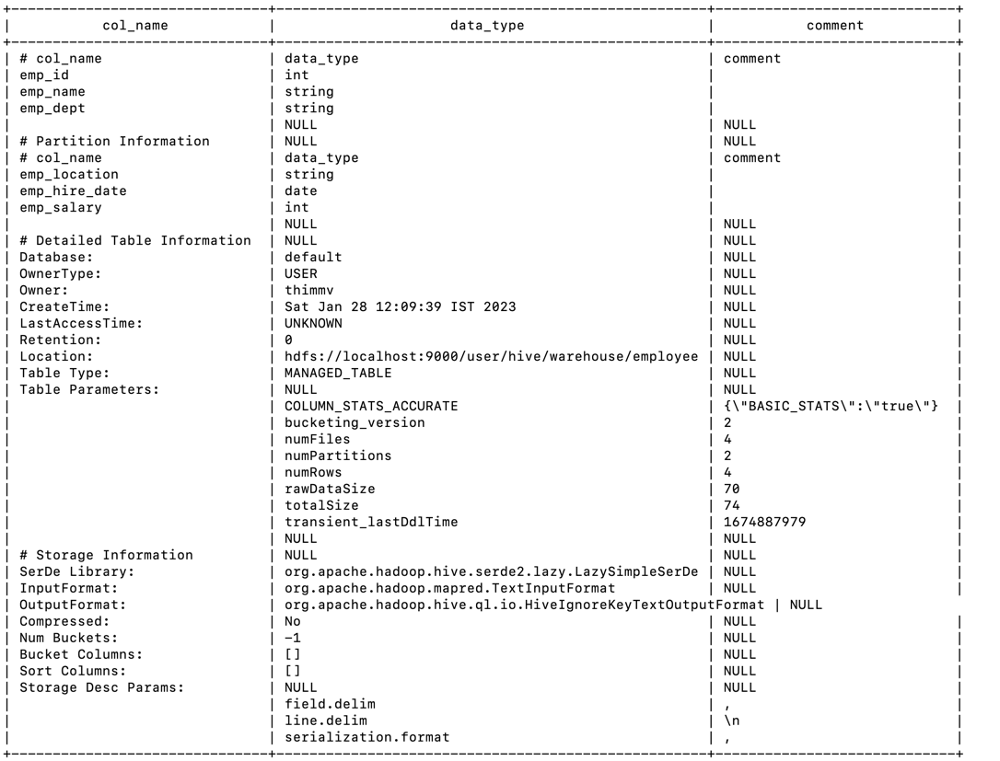
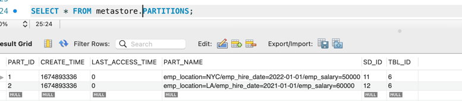
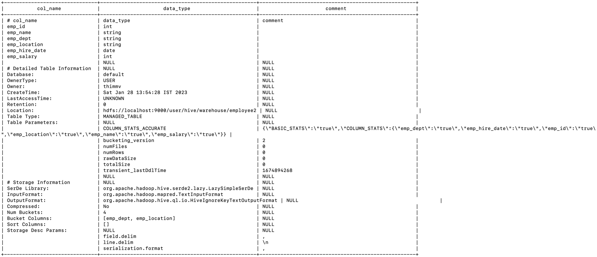
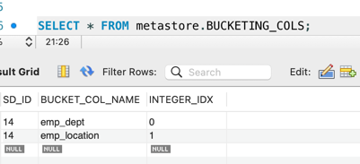

[Free Online Hive Practise](https://demo.gethue.com/)

[Wiki Ref](https://cwiki.apache.org/confluence/display/Hive/GettingStarted)

```shell
    nohup hive --service hiveserver2 --hiveconf hive.root.logger=ERROR &
    beeline -u jdbc:hive2://localhost:10000

    SET hive.execution.engine=mr|tez|spark; 
    set hive.resultset.use.unique.column.names=false; #Removes Table Name from output results
    SET hive.exec.dynamic.partition=true;
    SET hive.exec.dynamic.partition.mode=nonstrict;


```
```roomsql
    -- Surprises in Hive
    
    FROM Table1 t1
        JOIN
        Table2 t2
        ON t1.somecol = t2.somecol
    INSERT OVERWRITE DIRECTORY '/path/in/hdfs'
        SELECT * 
        WHERE filtersomething
    INSERT OVERWRITE LOCAL DIRECTORY '/path/in/local_file'
        SELECT * 
        WHERE filtersomething
    INSERT OVERWRITE TABLE X
        SELECT t1.*, t2.*
        WHERE filtersomething
        GROUP BY someColumn
    INSERT OVERWRITE TABLE Y PARTITION(col1, col2, ... )
        SELECT t1.*, t2.*
        WHERE filtersomething
        GROUP BY someColumn;
    
      

```


```roomsql

--  Partitioned Table
CREATE TABLE EMPLOYEE (emp_id INT, emp_name STRING, emp_dept STRING)
 PARTITIONED BY (
  emp_location STRING,
  emp_hire_date DATE,
  emp_salary INT
)
 ROW FORMAT DELIMITED FIELDS TERMINATED BY ',' LINES TERMINATED BY '\n';
 
```


 


```roomsql
-- Bucketed Table

CREATE TABLE EMPLOYEE2 (emp_id INT, emp_name STRING, emp_dept STRING, emp_location STRING, emp_hire_date DATE, emp_salary INT) 
CLUSTERED BY (emp_dept) INTO 4 BUCKETS
ROW FORMAT DELIMITED FIELDS TERMINATED BY ',' LINES TERMINATED BY '\n';

```



