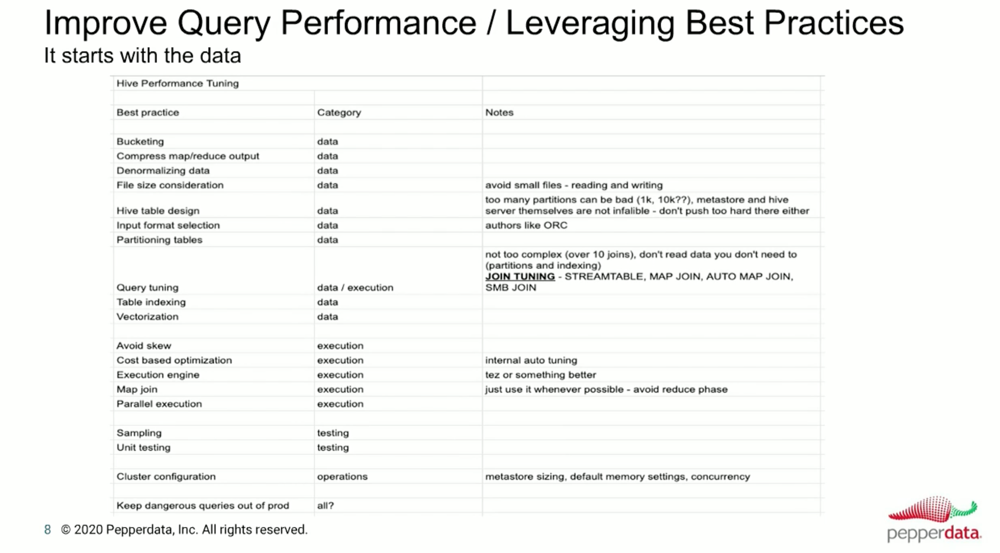

[Free Online Hive Practise](https://demo.gethue.com/)

[Wiki Ref](https://cwiki.apache.org/confluence/display/Hive/GettingStarted)

```textmate

Performance Improvements: Compute/Store/Network/Security

    Table Design ( proper data types )
    File Format ( row or columnar )
    Partitioning ( not sure how many splits you want to do )
    Bucketing ( doesn't matter how many split, but always store in FIXED : hash_id%total_buckets )
    Compression ( no problem with compute, but storage and network i/o is important )
    Compaction( Small File Problem )
    Execution Engine as Tez/Spark
    De-Normalize (duplicating data is okay instead of joining)
    CBO ( altering explain plans based on metadata )
    Vectorization ( running data in batches instead of row by row supports only ORC )
        - instead of (for i=1; i<n; i++) { do something for i } -> treat as for(i=1, i<n; i+batch) {do something for every element in i -> batch }
** Join Type Hints ** 
    1. Small vs Small
    2. Small vs Large
    3. Large vs Large

** LLAP **
   Don't use it if you are running batch jobs and same query is not repeatedly used
   Useful when same table/query hit multiple times in span of short time. 

```


```shell
    nohup hive --service hiveserver2 --hiveconf hive.root.logger=ERROR &
    beeline -u jdbc:hive2://localhost:10000
    
     analyze table employee compute statistics;
    
    hdfs dfs -mkdir -p /user/hive/warehouse
    hdfs dfs -chmod g+w /user/hive/warehouse
    hdfs dfs -chmod g+w /tmp

    set hive.execution.engine=mr|tez|spark; 
    set hive.resultset.use.unique.column.names=false; #Removes Table Name from output results
    
    set hive.merge.mapfiles=true;
    set mapreduce.input.fileinputformat.split.maxsize
    set mapreduce.input.fileinputformat.split.minsize

    
    set hive.mapred.mode=strict; # Forces to use partition condition in WHERE clause
    set hive.exec.dynamic.partition=true;
    set hive.exec.dynamic.partition.mode=nonstrict|strict; # strict mean atleast one partition column must be static
    set hive.mapred.mode = strict # Static Partition
    set hive.exec.max.dynamic.partitions.pernode:  # Per mapper/reducer
    set hive.exec.max.dynamic.partitions: # All Mapper/Reducers 
    set hive.exec.max.created.files: # All Mapper/Reducers
    set hive.error.on.empty.partition: false
    
    set hive.enforce.bucketing = true;

    set hive.vectorized.execution.enabled=true;
    set hive.vectorized.execution.batch.size=<desired batch size>;

    # Map Join
    set hive.auto.convert.join=true;
    set hive.mapjoin.smalltable.filesize=50 #25MB is default
    set hive.auto.convert.join.noconditionaltask = true; # when more than 2 small tables involved in join
    set hive.auto.convert.join.noconditionaltask.size = 10000000; # when all small tables in join has <10Mb, all joins  are converted into single MAP join
    # Bucketed Join
    set hive.optimize.bucketmapjoin = true # applicable when bucketing is enabled.

    # SortMerge Join
    set hive.optimize.bucketmapjoin.sortedmerge = true;
   

```
```roomsql
    -- Surprises in Hive
    
    hive.optimize.ppd=true; -- This helps FILTER first and then JOIN
    
    FROM Table1 t1
        JOIN
        Table2 t2
        ON t1.somecol = t2.somecol
    INSERT OVERWRITE DIRECTORY '/path/in/hdfs'
        SELECT * 
        WHERE filtersomething
    INSERT OVERWRITE LOCAL DIRECTORY '/path/in/local_file'
        SELECT * 
        WHERE filtersomething
    INSERT OVERWRITE TABLE X
        SELECT t1.*, t2.*
        WHERE filtersomething
        GROUP BY someColumn
    INSERT OVERWRITE TABLE Y PARTITION(col1, col2, ... )
        SELECT t1.*, t2.*
        WHERE filtersomething
        GROUP BY someColumn;
     
    -- convert multi-values Single Column to ROW.    
    select city, pin_code from state 
        lateral view explode(pin_codes) pin_tables as pin_code; 
        
    select city, idx, pin_code from state
        lateral view posexplode(pin_codes) pin_tables as idx, pin_code;
         
    set hive.optimize.skewjoin = false
    set hive.skewjoin.key=X -- number: max unique values allowed per column to mark it as skew     
    set hive.skewjoin.mapjoin.map.tasks=Y -- number
    set hive.skewjoin.mapjoin.min.split=Z -- size in bytes
```


```roomsql

--  Partitioned Table
CREATE TABLE EMPLOYEE (emp_id INT, emp_name STRING, emp_dept STRING)
 PARTITIONED BY (
  emp_location STRING,
  emp_hire_date DATE,
  emp_salary INT
)
 ROW FORMAT DELIMITED FIELDS TERMINATED BY ',' LINES TERMINATED BY '\n';

set hive.error.on.empty.partition=false;
set hive.exec.dynamic.partition=true;
set hive.exec.dynamic.partition.mode=nonstrict;
set hive.exec.max.created.files=X;
set hive.exec.max.dynamic.partitions=Y;
set hive.exec.max.dynamic.partitions.pernode=Z;


-- Some operations on Partitions
show partitions employee; 
show partitions employee partition(emp_location='LA');
show partitions employee partition(emp_location='LA', emp_hire_date='2022-01-01');
ALTER TABLE employee DROP IF EXISTS PARTITION (emp_location='VK', emp_hire_date='2023-01-01') IGNORE PROTECTION PURGE;
ALTER TABLE employee ADD IF NOT EXISTS PARTITION(emp_location='VK', emp_hire_date='2023-01-01') LOCATION 'hdfs://localhost:9000/user/hive/warehouse/employee/emp_location="VK"/emp_hire_date="2023-01-01"'; 
-- move some partition from one table to other
ALTER TABLE employee_backup EXCHANGE PARTITION (emp_location='VK') WITH TABLE employee;

```


 


```roomsql
-- Bucketed Table
set hive.enforce.bucketing = true;
CREATE TABLE EMPLOYEE2 (emp_id INT, emp_name STRING, emp_dept STRING, emp_location STRING, emp_hire_date DATE, emp_salary INT) 
CLUSTERED BY (emp_dept) INTO 4 BUCKETS
ROW FORMAT DELIMITED FIELDS TERMINATED BY ',' LINES TERMINATED BY '\n';

```


**Beeline** 

```shell
beeline -u jdbc:hive2://localhost:10000/default
        -d org.apache.hive.jdbc.HiveDriver
        --hiveconf hive.cli.print.header=true
        --hivevar year=2023
        -n hive
        -p vinodh
        -w /some_path_in_hdfs/.credentials
        -e "Select * from table where year = ${year}"
        -f /some_path_in_hdfs/table_query.hql
        --property-file /some_path_in_hdfs/hive-common.properties
        --color=true #colorize output of beeline
        --showHeader=false
        --outputformat=[table/vertical/csv/tsv/dsv/csv2/tsv2]
        --verbose=true #more log info
        --silent=true #less log info
        

```


````roomsql 
    
    drop database if exists hive_learning cascade/restrcit; -- cascade drops all tables before dropping db. restrict avoid dropping db if some tables exists       
    create database if not exists hive_learning comment 'Hive Leanring Database'  with dbproperties('created_by'='Vinodh', 'created_at'='Feb 1 2023')
    alter database hive_learning set dbproperties('created_at'='India', 'created_on'='Feb 1 2023');
    describe database extended hive_learning;
    show create database hive_learning;
    create table hive_learning.copy_employee like default.employee; -- copy table structures across databases
    
    drop table if exists employee purge; -- purge make sure deleted data is not moved to TRASH folder
    truncate table employee; -- only data is removed, not schema
    alter table employee rename to employee_v1;
    alter table employee SET TBLPROPERTIES ('comment' = 'This is a new comment');

    CREATE INDEX employee_id ON TABLE employee(emp_id) AS 'org.apache.hadoop.hive.ql.index.compact.CompactIndexHandler' WITH DEFERRED REBUILD;

    
````
[Hive Talk](https://www.brighttalk.com/webcast/13073/407775?utm_source=Pepperdata&utm_medium=blog&utm_campaign=Hive_post_2021)

